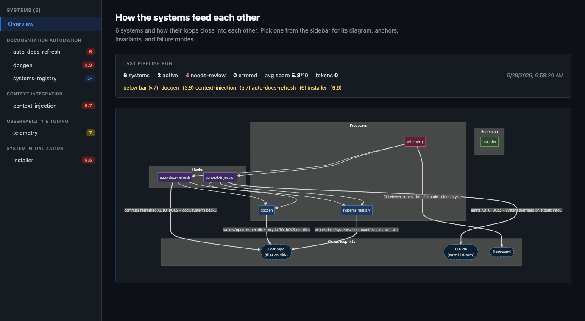
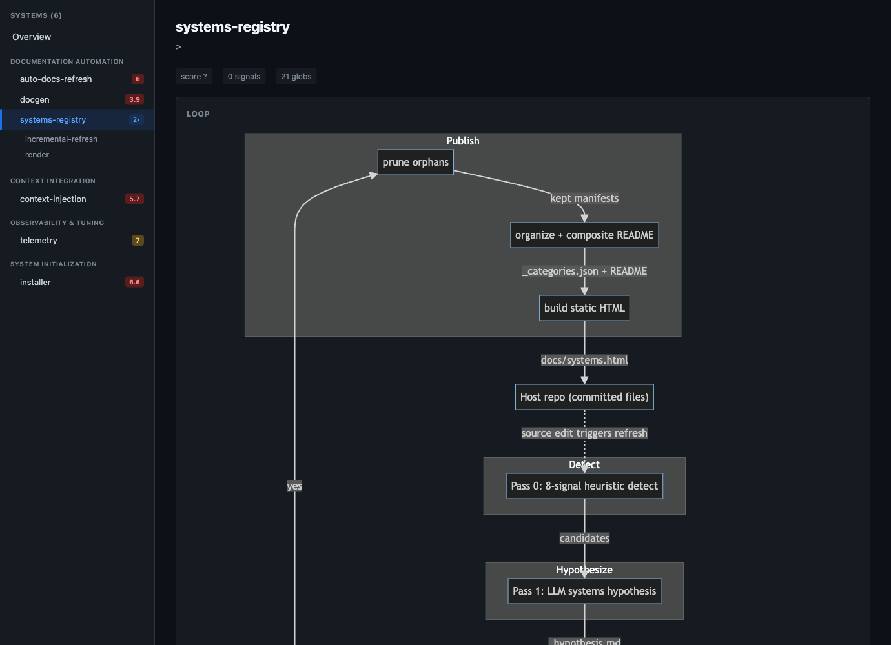
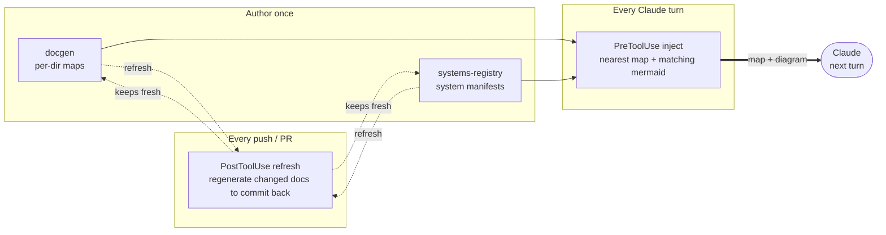

<div align="center">

# codecontext

### Your repo, documented by an LLM — and kept that way on every push.

**Per-directory maps · cross-file system manifests · context injected straight into Claude — auto-refreshed on every PR.**

</div>

---

Codebases drift. Docs rot. Agents waste half their turns re-discovering structure with `grep` and `find`. **codecontext** fixes that: it reads your repo with an LLM, writes agent-shaped documentation next to the code, and injects the *relevant slice* into Claude's context the moment it touches a file — then keeps all of it current automatically on every push.

Install it once. Never hand-write a directory README again.



## What you get

| Capability | What it produces | When it runs |
|---|---|---|
| **docgen** | One `AUTO_DOCS.md` per directory — a jump-table (concept → file · symbol), deep-first and semver-versioned. Agent-shaped, not human-shaped. | Bootstrap once; refreshed incrementally on every push. |
| **systems-registry** | Per-system manifests (`docs/systems/<name>.md`): front-matter + a **mermaid loop diagram** + anchors + invariants + failure modes, each scored 0–10 against the real source by an LLM judge. Plus a static HTML viewer. | `cli.mjs run` for a full sweep; incremental on every push. |
| **context injection** | The nearest `AUTO_DOCS.md` map + any matching system's mermaid, injected into Claude's context the instant it reads or edits a file. | Automatically, via a `PreToolUse` hook. |
| **auto-docs-refresh** | A detached hook that sees `git push` / PR creation, refreshes the docs that changed, and commits the diff back onto the branch — so the PR carries its own doc updates. | Automatically, via a `PostToolUse` hook. |

## See it

**Every system gets a manifest with a real mermaid loop, anchors, invariants, and failure modes:**



**And when Claude opens a file, the relevant map is already in its context** — no searching:

```text
[docgen:context] You're about to access `systems-registry/pass2.mjs`. Injected below:
the FULL map (AUTO_DOCS.md) for the file's own directory + a one-line Purpose for each
ancestor directory's map. The map is a jump-table (concept → file · symbol).

### systems-registry/AUTO_DOCS.md  (docgen-generated v0.1.0)
- Detect cross-file systems → detect.mjs · detectSystems
- Pass 1 hypothesis (LLM) → pass1.mjs · synthesizeSystems
- Per-system body generation → pass2.mjs · generateBody
- LLM-as-judge scoring → validate.mjs · scoreManifest
…
```

## Install

### As a Claude Code plugin (one command)

```text
/plugin marketplace add decider/codecontext
/plugin install codecontext@codecontext
```

Hooks auto-wire via `${CLAUDE_PLUGIN_ROOT}`; `/plugin update` pulls the latest. Per-user, nothing committed to your repo.

### As a vendored submodule (committed, CI-active, shared by the whole team)

```bash
git submodule add https://github.com/decider/codecontext.git tools/codecontext
tools/codecontext/scripts/install.sh
```

This symlinks the plugin at `tools/codecontext/`, merges the hook entries into your `.claude/settings.json`, and ensures `docs/systems/` exists. Because the hooks live in the committed settings, they run for every contributor and in CI.

> **Plugin vs submodule:** the plugin is the fastest way for an individual to try it. The submodule is what makes a repo *self-documenting for a whole team* — the hooks travel with the repo and run in CI. They coexist.

## Bootstrap

```bash
# Per-directory maps (one-time; ~10–25s/dir, parallelisable)
node tools/codecontext/docgen/docgen --until-done --parallel 4

# Detect + document + score systems (one-time full sweep; incremental on push after)
node tools/codecontext/systems-registry/cli.mjs run

# Browse the registry locally (rendered mermaid in your browser)
node tools/codecontext/systems-registry/cli.mjs view
```

After that, do nothing. The push hook sees every `git push` / `gh pr create`, refreshes the docs that changed in the background, and commits the diff back onto the branch.

## How it works



- **docgen owns `AUTO_DOCS.md`** in each directory — it never touches a hand-written `README.md`, so humans and the tool never collide.
- **systems-registry** detects coordinated, cross-file "systems" (a pipeline whose pieces span disjoint dirs and whose loop closes back into something), writes a manifest per system, and has an LLM judge score it against the real code — manifests below threshold are flagged `needs-review`.
- **Per-repo context:** drop a `docs/systems/_context.md` with domain facts the code alone can't reveal; every LLM pass treats it as authoritative.

## Pluggable judges

Both validators default to `claude -p` but accept any stdin→stdout CLI — use a *different* model as judge to catch self-blindness:

```bash
DOCGEN_JUDGE_CMD="codex exec"   node tools/codecontext/docgen/validate-readme.mjs <dir>
SYSREG_JUDGE_CMD="gemini -p"    node tools/codecontext/systems-registry/cli.mjs validate --target <name>
```

## Tests

```bash
node --test docgen/*.test.mjs systems-registry/*.test.mjs hooks/*.test.mjs
```

All hermetic — each test builds a `mkdtempSync` fixture and tears down on exit; nothing touches a real repo.

## License

MIT
