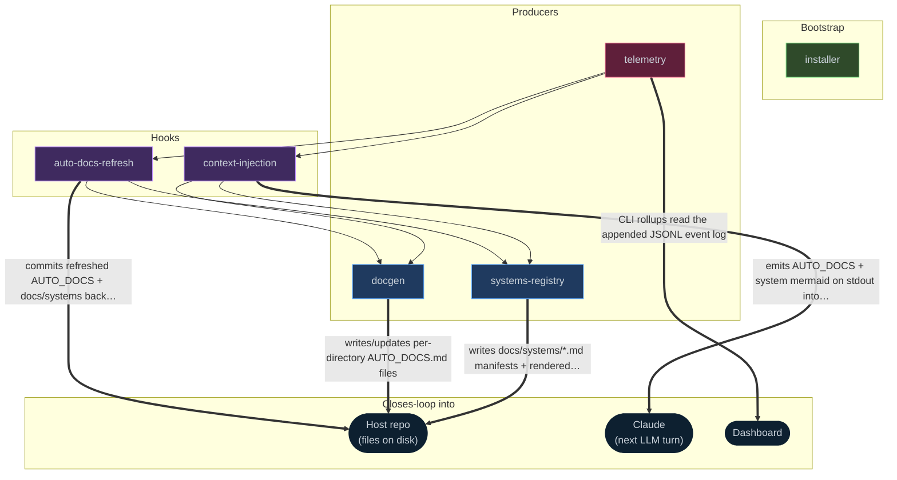

<!-- auto-generated by systems-registry composite — refresh with `tools/systems-registry/cli.mjs build` -->

# Systems Registry — codecontext

Index of **complex systems** in this repo — coordinated multi-file pipelines
whose pieces span disjoint dirs and whose loops close back into something
(the dashboard, CI, the user, a future LLM turn).

Each file here is a manifest with YAML front-matter (`name`, `summary`,
`globs`, `inject` config) plus a markdown body (loop diagram + anchors +
invariants + failure modes). A PreToolUse hook in `.claude/settings.json`
matches the path Claude is about to touch against every system's globs and
injects the matching system's Mermaid + page link into the next LLM turn.

Source of truth for detection rules: `tools/systems-registry/detect.mjs`.

## How these systems feed each other

## Quick reference

| System | Summary |
|---|---|
| [auto-docs-refresh](auto-docs-refresh.md) | Per-PR documentation refresh driven by Claude Code hooks. A PostToolUse(Bash) hook detects PR-opening/updating commands and commits regenerated AUTO_DOCS + docs/systems back onto the branch; a compani |
| [context-injection](context-injection.md) | Two sibling PreToolUse hooks fire before Read/Edit/Write/Glob/Grep, locate the docs relevant to the touched path (ancestor AUTO_DOCS.md/CLAUDE.md, and glob-matched system pages), and feed their conten |
| [docgen](docgen.md) | Per-directory AUTO_DOCS.md generator for Claude agents: docgen.mjs walks the repo bottom-up, detects content-hash staleness, and feeds each stale directory to claude -p; inject-readme-context.mjs make |
| [installer](installer.md) | One-shot bootstrapper that wires the codecontext plugin into a host repo: vendors the plugin under `tools/codecontext/`, idempotently merges the plugin's hook entries into the host's `.claude/settings |
| [systems-registry](systems-registry.md) | Detects cross-file "systems" with an 8-signal heuristic, then drives a multi-pass `claude -p` pipeline (hypothesis → body → vet → revise → judge → refine → organize → composite → static build) that em |
| [telemetry](telemetry.md) | Cross-session telemetry for context-injection hooks. Hooks append one JSONL event per fire into machine-wide `~/.claude-telemetry/`, and a CLI viewer rolls those events up into per-session, per-hook,  |
