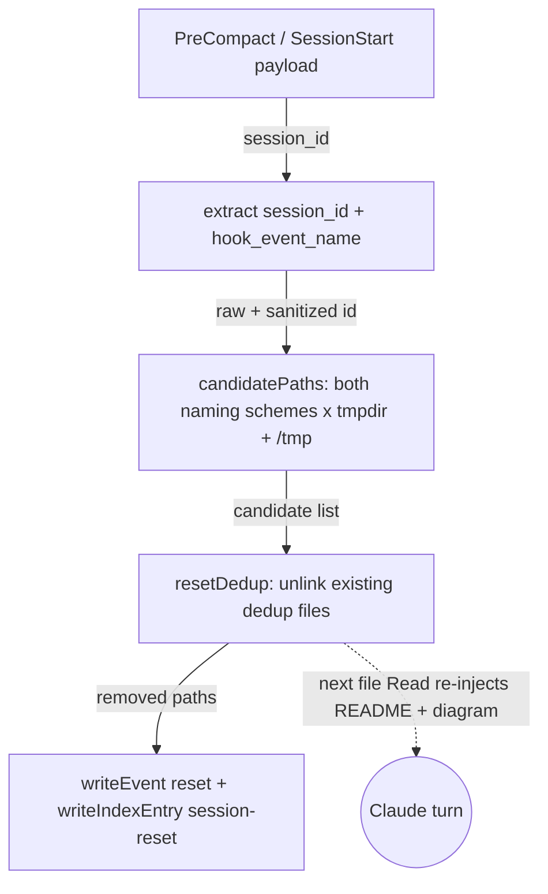

<!-- auto-generated by systems-registry — do not hand-edit. Run `tools/systems-registry/cli.mjs run` (full sweep) or `tools/systems-registry/cli.mjs refresh --changed <files>` (incremental) to refresh. -->


# auto-docs-refresh

## What it does

`hooks/auto-docs-refresh.mjs` fires on every `PostToolUse(Bash)` call but does real work only when `isPrCommand()` matches `gh pr create` or `git push` of a feature branch. Its fast `main()` does cheap marker/lock checks then spawns `runDetachedWorker()`, which fetches, diffs against `origin/main`, runs whichever doc tools `docgenCandidates()` / `sysregCandidates()` resolve, and — if any `docPathsFromStatus()` files changed — commits and pushes them onto the branch so they ride the squash-merge into main. `hooks/reset-inject-dedup.mjs` runs on `PreCompact`/`SessionStart` and calls `resetDedup()` to delete the per-session dedup files, so the next file Read re-injects the now-fresh README and system diagram.

## The loop

```mermaid
flowchart TB
  subgraph FastHook["Fast hook path — main()"]
    B[PostToolUse Bash payload]
    Q{isPrCommand?}
    BR{branch is main/master?}
    MK{marker == HEAD sha?}
    LK{lock held & fresh?}
    CLAIM[claim lock O_CREAT|O_EXCL + spawn detached worker]
  end
  subgraph Worker["Detached worker — AUTODOC_SKIP=1"]
    FD[fetch + diff branch vs origin/main]
    RF[run docgen + systems-registry refresh]
    CH{doc paths changed?}
    CP[commit + push docs onto branch]
    WM[write HEAD marker + release lock]
  end
  B -->|tool_input.command| Q
  Q -->|no| X1((no-op exit 0))
  Q -->|yes| BR
  BR -->|yes| X2((skip — never touch main))
  BR -->|no| MK
  MK -->|yes| X3((already refreshed))
  MK -->|no| LK
  LK -->|yes| X4((another run in progress))
  LK -->|no| CLAIM
  CLAIM -->|root, branch, head| FD
  FD -->|changed files| RF
  RF -->|git status --porcelain| CH
  CH -->|no| WM
  CH -->|yes| CP
  CP -->|pushed branch| WM
  WM -.->|squash-merge to main| NEXT((next clone / session reads fresh docs))
```

## Subflow: reset-inject-dedup

Independent of the refresh flow: on compaction or session start, wipe the dedup files that otherwise tell the inject hooks "already shown" after the diagrams were evicted from context.



## Anchors

- `hooks/auto-docs-refresh.mjs` — the PostToolUse hook; `main()` fast path + `runDetachedWorker()` slow path.
- `hooks/auto-docs-refresh.mjs:isPrCommand` — the gate deciding whether a Bash command warrants a refresh.
- `hooks/auto-docs-refresh.mjs:docgenCandidates / sysregCandidates` — portability: resolves host-repo vendored tools or the bundled siblings.
- `hooks/reset-inject-dedup.mjs:candidatePaths / resetDedup` — the dedup-file reset across both inject scripts' naming conventions.

## Closing arrow

The worker commits the regenerated `AUTO_DOCS.md` + `docs/systems` onto the feature branch and pushes (`CP` node), so the docs ride the eventual squash-merge into `main`. A future clone/session reads the merged-fresh docs, and after a compaction `reset-inject-dedup` clears the dedup state so those docs re-enter the model's context on the next file Read — closing the loop back to a Claude turn.

## Log flow

| Marker / Event | Emitter (file:fn) | Fields | Consumer | Lands in |
|---|---|---|---|---|
| `refresh-spawned` | `auto-docs-refresh.mjs:main` (`_telemetry`) | branch, head, root, worker_pid | telemetry reader | `telemetry/writer.mjs` writeEvent |
| `refresh-skipped` | `auto-docs-refresh.mjs:main` (`_telemetry`) | reason (not-a-git-repo / main-branch / already-refreshed / lock-held / lock-race-lost), head, root | telemetry reader | `telemetry/writer.mjs` writeEvent |
| `reset` | `reset-inject-dedup.mjs:main` (`writeEvent`) | reason (hook_event_name), dedup_files_removed, removed_paths | telemetry reader | `telemetry/writer.mjs` writeEvent |
| `session-reset` | `reset-inject-dedup.mjs:main` (`writeIndexEntry`) | reason, dedup_files_removed | cross-session rollup | `telemetry/writer.mjs` index |

## Data tables

| Table / File | Schema / Migration | Writer (file:fn) | Reader (file:fn) | Purpose |
|---|---|---|---|---|
| `<git-dir>/auto-docs-refresh.sha` | n/a (raw sha) | `auto-docs-refresh.mjs:runDetachedWorker` (write marker) | `auto-docs-refresh.mjs:main` (marker == HEAD check) | Per-HEAD dedup so create-then-push won't double-run |
| `<git-dir>/auto-docs-refresh.lock` | n/a (`pid head`) | `auto-docs-refresh.mjs:main` (`openSync 'wx'`) | `auto-docs-refresh.mjs:main` (lock-held check); worker refreshes mtime/releases | Atomic mutual exclusion of overlapping refreshes |
| `<tmpdir|/tmp>/systems-registry-injected-<sid>.json` | n/a | systems-registry `inject.mjs` (external) | `reset-inject-dedup.mjs:resetDedup` (unlink) | Per-session "already injected" flag for system pages |
| `<tmpdir|/tmp>/docgen-injected-<safe>.json` | n/a | docgen `inject-readme-context.mjs` (external) | `reset-inject-dedup.mjs:resetDedup` (unlink) | Per-session "already injected" flag for READMEs |
| `/tmp/auto-docs-refresh.log` | append-only text | both phases (`log()`, worker stdio) | operator | Timeline of spawns/skips/worker output |

## Invariants

- Both hooks ALWAYS exit 0 — they never block a Bash call, compaction, or session start (`auto-docs-refresh.mjs` header; `reset-inject-dedup.mjs` `.finally(() => process.exit(0))`).
- Never touches `main`/`master`: `main()` returns early when `branch === 'main' || branch === 'master'`.
- Lock claim is atomic via `openSync(lock, 'wx')` (`O_CREAT | O_EXCL`) — only one of two racing `main()` calls wins; the loser logs `lock-race-lost`.
- Re-entry guard: the worker is spawned with `AUTODOC_SKIP=1`, and `main()` returns immediately when it sees that env var.
- Timeouts: `REFRESH_TIMEOUT_MS = 8 * 60 * 1000` SIGKILLs a hung child; `LOCK_STALE_MS = 20 * 60 * 1000` reaps an abandoned lock by mtime.

## Failure modes

- Worktree `.git` is a file (linked worktree), so the marker/lock must land in `gitDir()`'s `rev-parse --git-dir` location, not `<root>/.git` — else writes fail with "not a directory".
- A crashed worker that never reached `WM` leaves the marker unwritten; the next push re-runs (correct) but a stale lock blocks until `LOCK_STALE_MS` elapses.
- After compaction without `reset-inject-dedup` firing, dedup files would falsely report "already injected" and the fresh diagrams would silently never re-enter context.
- `docgenCandidates`/`sysregCandidates` resolving to neither a host-repo copy nor a bundled sibling makes the refresh a silent no-op (no tools to run).

## Where to start reading

1. `hooks/auto-docs-refresh.mjs:isPrCommand` — the gate that decides if anything happens at all.
2. `hooks/auto-docs-refresh.mjs:main` — fast PostToolUse path: marker/lock checks and the detached spawn.
3. `hooks/auto-docs-refresh.mjs:runDetachedWorker` — the slow path that fetches, refreshes, commits, pushes.
4. `hooks/reset-inject-dedup.mjs:resetDedup` — the companion reset that lets fresh docs re-enter context.