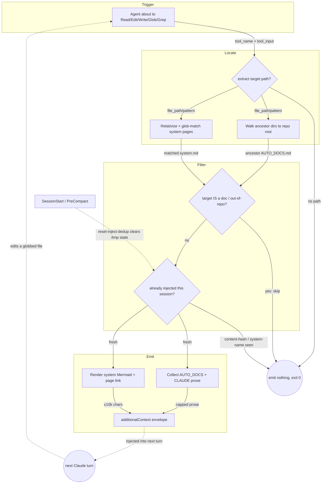

<!-- auto-generated by systems-registry — do not hand-edit. Run `tools/systems-registry/cli.mjs run` (full sweep) or `tools/systems-registry/cli.mjs refresh --changed <files>` (incremental) to refresh. -->

# context-injection

## What it does

On every `Read`/`Edit`/`Write`/`Glob`/`Grep`, two PreToolUse hooks run: `inject-readme-context.mjs` walks from the tool's target path up the git-repo tree (via `ancestorsUpTo`) collecting each directory's `AUTO_DOCS.md` + `CLAUDE.md`, while `inject.mjs` relativizes the target against the host repo root and runs `match(systems, rel)` against `docs/systems/*.md` glob front-matter. Both dedup per-session and emit their payload through `hookSpecificOutput.additionalContext` so the docs land in the model's next view without the agent ever asking for them.

## The loop

## Anchors

- `docgen/inject-readme-context.mjs` — ancestor-walk hook; finds AUTO_DOCS.md/CLAUDE.md up the tree, dedups by content hash, emits per-dir prose.
- `systems-registry/inject.mjs` — system-level hook; `injectionPlan()` glob-matches the target against `docs/systems/*.md` and emits the matched system's Mermaid + link.
- `systems-registry/registry.mjs` — `loadAll` / `match` / `renderInjection` (the glob index + injection formatter the hook depends on).
- `hooks/hooks.json` — plugin-mode wiring registering both inject hooks under the `Read|Edit|Write|Glob|Grep` matcher.
- `hooks/reset-inject-dedup.mjs` — clears the per-session dedup files on SessionStart/PreCompact.

## Closing arrow

The loop closes through the model's context, not a network call: each hook writes a `hookSpecificOutput.additionalContext` JSON envelope to stdout, which Claude Code appends to the **next LLM turn**. When that turn touches another globbed/nested file, the PreToolUse matcher fires again — the agent's own tool calls drive re-entry. Per-session `/tmp/*-injected-<sid>.json` dedup files (reset by `reset-inject-dedup.mjs` on SessionStart/PreCompact) keep the loop from re-emitting identical context on every Read.

## Decision logic

Each hook independently decides whether to inject:
- **Target resolution** — `extractTargetPath` / `targetPathFrom` pull a path from `file_path`, `Glob` `path`/`pattern` (wildcards stripped to an anchor dir), or `Grep` `path`; tools with no path fall through silently.
- **docgen** anchors at the git repo root (`git rev-parse --show-toplevel`), walks at most `MAX_ANCESTORS=6` directories upward, skips targets whose basename is in `NOOP_BASENAMES` (`AUTO_DOCS.md`, `CLAUDE.md`), and dedups by **content hash** (`contentHash` = 16 hex of sha1) so byte-identical docs across worktrees inject once. Ancestor READMEs contribute only their `## Purpose` body via `extractPurpose`.
- **systems-registry** resolves the **host** repo root (`findRepoRoot` prefers `payload.cwd`, then `--show-superproject-working-tree` to escape a submodule), rejects out-of-repo (`rel.startsWith('..')`) and `docs/systems/` self-targets, then emits each matched system once — dedup keyed by **system name**.

## Log flow

| Marker / Event | Emitter (file:fn) | Fields | Consumer | Lands in |
|---|---|---|---|---|
| `additionalContext` (PreToolUse envelope) | `inject.mjs:main` / `inject-readme-context.mjs:main` | hookEventName, additionalContext (≤10k chars) | Claude Code → next LLM turn | model context |
| `injected` | `inject.mjs:main` (via `telemetry/writer.mjs:writeEvent`) | hook, sid, target_file, bytes_emitted, {repo_root, blocks} | operator | `~/.claude-telemetry/` |
| `deduped` | `inject.mjs:main` (real glob-match already-injected only) | hook, sid, target_file, bytes_emitted=0, {repo_root} | operator | `~/.claude-telemetry/` |
| `injected` (docgen) | `inject-readme-context.mjs:main` via `writeEvent` | hook, event, sid, {tool} | operator | `~/.claude-telemetry/` |

## Data tables

| Table / File | Schema / Migration | Writer (file:fn) | Reader (file:fn) | Purpose |
|---|---|---|---|---|
| `/tmp/docgen-injected-<sid>.json` | JSON array of content hashes | `inject-readme-context.mjs:saveDedup` | `inject-readme-context.mjs:loadDedup` | Per-session dedup of injected READMEs by content |
| `/tmp/systems-registry-injected-<sid>.json` | `{ systems: [name] }` | `inject.mjs:saveDedupe` | `inject.mjs:loadDedupe` | Per-session dedup of injected system pages by name |
| `<dir>/AUTO_DOCS.md`, `<dir>/CLAUDE.md` | docgen marker `<!-- docgen:version=… -->` | docgen pipeline (external) | `inject-readme-context.mjs:readFileSync` | Per-directory prose injected on nested touches |
| `docs/systems/*.md` | YAML front-matter (`globs`, mermaid) | systems-registry pipeline (external) | `inject.mjs` via `registry.mjs:loadAll` | System manifests glob-matched and injected |

## Invariants

- Hooks NEVER block: every error path exits 0 with no output (`inject-readme-context.mjs` top comment; `inject.mjs:main` try/catch + `exitedOk`). A non-zero exit would block the agent's tool call.
- Injected context is capped at `MAX_CONTEXT_CHARS = 10000` per fire (`inject.mjs`); per-README bytes capped at `MAX_README_BYTES = 6 * 1024`; ancestor walk capped at `MAX_ANCESTORS = 6`.
- Only the `hookSpecificOutput.additionalContext` JSON envelope reaches the model — plain stdout from a PreToolUse hook goes to the user transcript, not Claude's context.
- docgen dedups by **content hash**, systems-registry by **system name** — the keys differ deliberately so identical docs across worktrees collapse to one injection.
- systems-registry telemetry fires `injected`/`deduped` only; `out-of-repo`/`no-match`/`system-page`/`no-target`/`tool-no-paths` are silent to keep the log clean.

## Failure modes

- **Submodule root mis-detection**: if `findRepoRoot` resolves the submodule instead of the host repo, `loadAll` finds 0 systems and the hook exits silently — the historical bug the `--show-superproject-working-tree` candidate fixes.
- **Stale dedup**: if `reset-inject-dedup.mjs` fails to clear `/tmp` state on SessionStart/PreCompact, an injected doc edited mid-session won't re-inject its updated content (still keyed as "seen").
- **Telemetry reference bug class**: `tool` was hoisted into `main` scope in docgen precisely because referencing an out-of-scope var threw on every fire and was swallowed by the no-throw guard — silent telemetry loss with no surfaced error.
- **Truncation**: a system page (or stack of ancestor docs) exceeding the cap is silently sliced, so very large manifests lose their tail in-context.
- **Outside a git repo**: `repoRoot`/`findRepoRoot` returns null and nothing injects — expected, but means scratch dirs get no context.

## Where to start reading

1. `hooks/hooks.json` — see what fires when (the matcher + both commands).
2. `systems-registry/inject.mjs` — `injectionPlan()` is the cleanest expression of the match→dedup→emit decision.
3. `docgen/inject-readme-context.mjs` — the ancestor-walk variant and the content-hash dedup rationale.
4. `hooks/reset-inject-dedup.mjs` — how the per-session loop state is cleared.