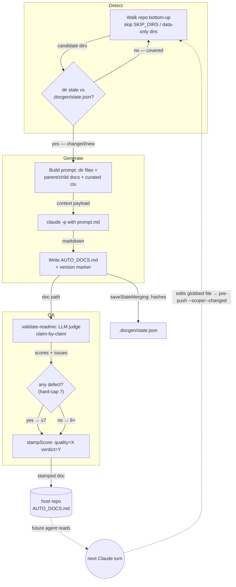

<!-- auto-generated by systems-registry — do not hand-edit. Run `tools/systems-registry/cli.mjs run` (full sweep) or `tools/systems-registry/cli.mjs refresh --changed <files>` (incremental) to refresh. -->

# docgen

## What it does

docgen generates one `AUTO_DOCS.md` per directory (`DOC_FILENAME` in `docgen.mjs`) so a future Claude agent can answer "what's in this folder" in one read instead of grepping. `docgen.mjs` walks the repo bottom-up, uses content-hash staleness (`loadState`/`saveStateMerging` against `.docgen/state.json`, version 2) to pick directories that were never analyzed or changed, feeds each dir's files plus the parent/child docs to `claude -p` using `prompt.md`, and writes the marked-up result. `validate-readme.mjs` then judges each doc claim-by-claim against the actual files (`buildReadmeValidatePrompt` + `parseReadmeValidation`, hard-capped at 7 on any defect), and `validate-all.mjs` stamps `quality=…` into each doc's version header via `stampScore`.

## The loop

## Anchors

- `docgen/docgen.mjs` — the generator: walk, staleness, prompt assembly, `claude -p` spawn, `AUTO_DOCS.md` write, `.docgen/state.json` persistence.
- `docgen/prompt.md` — the generation prompt; defines the `docgen:version=` marker and the Purpose/Map/Subdirectories/Dependencies/Gotchas doc shape.
- `docgen/validate-readme.mjs` — LLM-as-judge; `buildReadmeValidatePrompt`, `parseReadmeValidation` (weighted overall + hard cap), pluggable judge via `DOCGEN_JUDGE_CMD`.
- `docgen/validate-all.mjs` — batch validator; finds docgen-marked docs (`readmeIsDocgen`), runs the judge at concurrency, stamps scores (`stampScore`).

## Decision logic

docgen decides **which** directory to document and **in what order**. A dir is selected when content-hash staleness differs from `.docgen/state.json` (any file added/removed/modified) or it was never analyzed; trunk dirs additionally bubble up when a child doc changes. Ordering is strictly **bottom-up by depth** so trunk dirs can summarize already-documented children rather than re-derive them; within a single depth, `--parallel N` runs up to N `claude -p` calls concurrently while depth N-1 waits on its children. Directories are pruned when named in `SKIP_DIRS`, when they exceed `MAX_FILES_PER_DIR` (60), or when **every** file matches `DATA_EXTENSIONS` (data + prose with no code symbols to point at) and they have no documented children — the rule that keeps data-heavy repos from queuing thousands of empty dirs. Model defaults to `DEFAULT_MODEL` (`claude-sonnet-4-6`) because this is high-volume, low-judgment work; the validator judge defaults to Opus.

## Closing arrow

The loop closes through the **host repo's filesystem**: each run writes `<dir>/AUTO_DOCS.md` and records the directory's file hashes into `.docgen/state.json` via `saveStateMerging` (serialized through `_saveChain` so concurrent parallel writers don't clobber each other). A future Claude agent reads those docs as a navigation index; when that agent edits a globbed file, the pre-push hook re-invokes docgen with `--scope`/`--changed` restricted to the changed dirs (plus ancestors), refreshing only the affected docs.

## Log flow

docgen emits no runtime log markers across services; its cross-stage "signals" are the HTML-comment markers embedded in each generated doc, written by one stage and consumed by another.

| Marker / Event | Emitter (file:fn) | Fields | Consumer | Lands in |
|---|---|---|---|---|
| `<!-- docgen:version=X.Y.Z reason: … -->` | `prompt.md` (LLM output, line 1) | version, reason | `validate-all.mjs:stampScore`, version-bump post-processor | `AUTO_DOCS.md` head |
| `<!-- auto-generated by docgen … -->` | `docgen.mjs` `MARKER` | — | `validate-all.mjs:readmeIsDocgen` (first-comment match) | `AUTO_DOCS.md` head |
| `quality=X verdict=Y` stamp | `validate-all.mjs:stampScore` | score, verdict | humans / CI gate | `AUTO_DOCS.md` version comment |

## Data tables

docgen has no database; it reads and writes files on disk.

| Table / File | Schema / Migration | Writer (file:fn) | Reader (file:fn) | Purpose |
|---|---|---|---|---|
| `.docgen/state.json` | `loadState` v2 shape `{version,lastRun,directories}` | `docgen.mjs:saveState` / `saveStateMerging` | `docgen.mjs:loadState` | Content-hash staleness per dir; survives re-clones |
| `<dir>/AUTO_DOCS.md` | `prompt.md` doc structure | `docgen.mjs` (write step) | future Claude agents, `validate-*.mjs` | The agent-facing per-directory index |
| `.docgen/global.md`, `.docgen-context.md`, `.docgen-cascade.md` | curated free-text (≤ `MAX_CTX_BYTES` 4 KB) | maintainer (hand-authored) | `docgen.mjs` (collectCuratedContext) | Inject hand-written guidance into the prompt without polluting generated output |

## Invariants

- docgen **owns** `AUTO_DOCS.md`, never `README.md` — humans own README.md, so the two never collide (`DOC_FILENAME` in `docgen.mjs`).
- State is version 2 only; v1 (mtime-based) states are dropped silently, forcing a one-time re-bootstrap (`loadState`).
- No string reaches a shell — every subprocess uses `spawn`/`execFileSync` with explicit argv arrays, so user-supplied flags can't shell-inject (`docgen.mjs` header, `repoRoot`).
- Prompt inputs are bounded: `MAX_FILE_BYTES_FOR_PROMPT` (8 KB, truncated with marker), `MAX_FILE_BYTES_HARD` (1 MB skip), `MAX_FILES_PER_DIR` (60); validator uses `FILE_BYTE_CAP` 10240 over `MAX_FILES` 24.
- Validation hard-caps overall ≤7 whenever `issues` or `missing` is non-empty (`parseReadmeValidation`); `PASS_BAR`/gate is 7, weights `correctness .45 / completeness .35 / sizing .20`.

## Failure modes

- A transient `claude -p` blip during validation is retried (`withRetry`, 2 retries, 8s linear backoff); generation timeouts are bounded by `--timeout-ms` (`DEFAULT_TIMEOUT_MS` 5 min).
- Concurrent `--parallel` writes to `state.json` are serialized via `_saveChain`; without it the last writer would lose entries written by others between its read and write.
- The LLM can hallucinate Map symbols or invent gotchas — caught only by `validate-readme.mjs`, which is self-blind unless `DOCGEN_JUDGE_CMD` points it at a different model.
- Data-only / oversized directories are silently skipped, so a dir of `.md`/`.json` (or >60 files) gets no doc by design — an agent expecting coverage there finds none.

## Where to start reading

1. `docgen/docgen.mjs` — the whole pipeline: walk → staleness → prompt → `claude -p` → write → state. Read the header doc comment and config block first.
2. `docgen/prompt.md` — what the generated doc must contain and the version-marker contract.
3. `docgen/validate-readme.mjs` — how a doc is judged against its files, and the hard-cap scoring.
4. `docgen/validate-all.mjs` — batch orchestration and score-stamping over all docgen-marked docs.