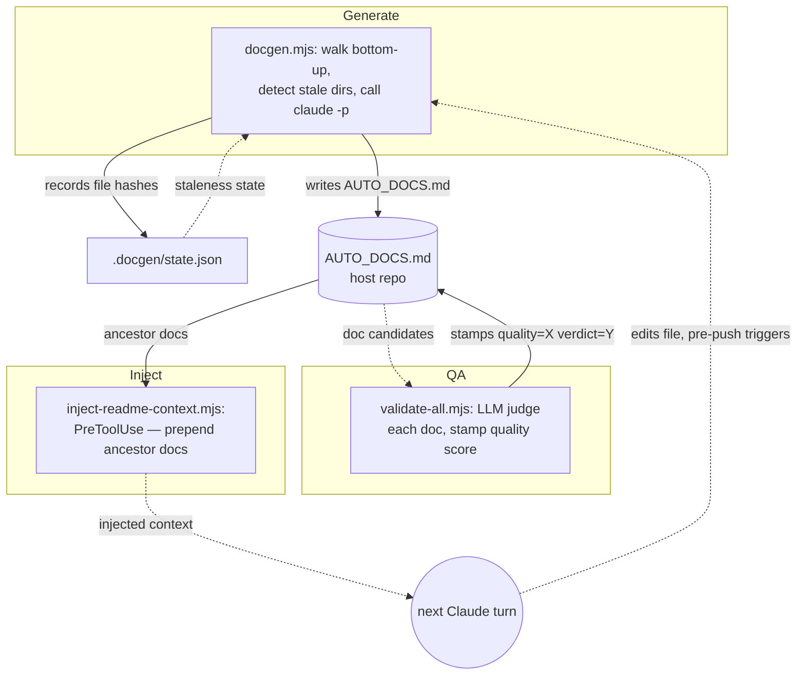
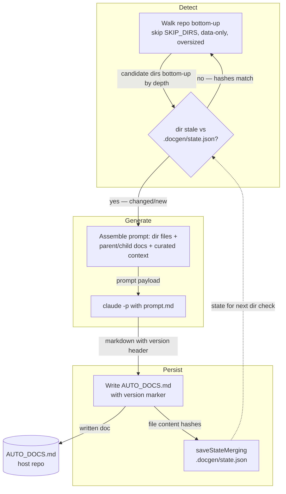
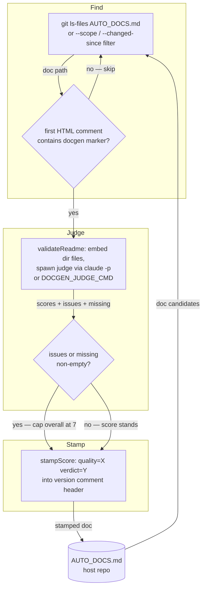
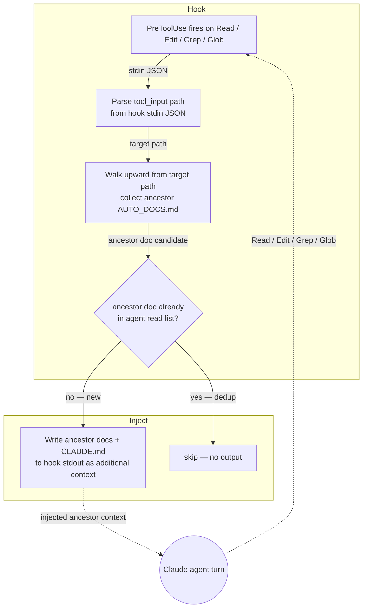

<!-- auto-generated by systems-registry — do not hand-edit. Run `tools/systems-registry/cli.mjs run` (full sweep) or `tools/systems-registry/cli.mjs refresh --changed <files>` (incremental) to refresh. -->

# docgen

## What it does

docgen has three independent runtime tools sharing only the filesystem. **`docgen.mjs`** walks the repo bottom-up, uses content-hash staleness (`loadState` / `saveStateMerging` against `.docgen/state.json` v2) to find directories that are new or changed, feeds each dir's files plus ancestor/child docs to `claude -p` via `prompt.md`, and writes the result to `<dir>/AUTO_DOCS.md` with an auto-generated marker and semver version line. **`inject-readme-context.mjs`** is a Claude Code `PreToolUse` hook that fires before any `Read` / `Edit` / `Grep` / `Glob`, walks upward from the target path, and prepends ancestor `AUTO_DOCS.md` files into the agent's context — making the generated docs load-bearing in live sessions. **`validate-all.mjs`** (backed by `validate-readme.mjs`) is a separate batch CLI that finds docgen-marked docs, judges each one claim-by-claim against its actual files, and stamps a `quality=X verdict=Y` score into the doc's version header; it is never called by `docgen.mjs`.

## The loop

## Subflow: generate

docgen.mjs generate loop — walks bottom-up, checks per-file content-hash staleness, assembles prompt, calls `claude -p`, writes `AUTO_DOCS.md`, persists state.

## Subflow: validate-and-stamp

validate-all.mjs batch pass — **separate CLI invocation**, not called by docgen.mjs. Finds docgen-marked docs, runs an LLM judge against actual files, stamps scores.

## Subflow: inject-context

inject-readme-context.mjs PreToolUse hook — fires transparently before each agent file operation, injects ancestor `AUTO_DOCS.md` as additional context.

## Anchors

- `docgen/docgen.mjs` — generator: walk, staleness detection (`needsAnalysis`), prompt assembly (`assembleContext`), `claude -p` spawn, `AUTO_DOCS.md` write, `.docgen/state.json` persistence (`saveStateMerging`).
- `docgen/prompt.md` — doc shape contract; defines the `<!-- docgen:version=X.Y.Z reason: … -->` marker, the Purpose / Map / Subdirectories / Dependencies / Gotchas structure, and semver bump semantics.
- `docgen/validate-readme.mjs` — LLM-as-judge: `buildReadmeValidatePrompt` assembles the claim-by-claim judge prompt; `parseReadmeValidation` computes weighted overall (correctness .45 / completeness .35 / sizing .20) with hard-cap at 7 on any defect; judge is pluggable via `DOCGEN_JUDGE_CMD`.
- `docgen/validate-all.mjs` — batch orchestration: `readmeIsDocgen` filters candidates (first-comment match), concurrent `runOne` drives validation, `stampScore` writes `quality=X verdict=Y` into each doc's version comment.
- `docgen/inject-readme-context.mjs` — Claude Code `PreToolUse` hook; reads hook stdin JSON (`tool_name` + `tool_input`), walks target path upward, injects ancestor `AUTO_DOCS.md` + `CLAUDE.md` into hook stdout as additional LLM context; deduplicates against files the agent has already explicitly read; never exits non-zero.

## Closing arrow

The loop closes through the **host repo's filesystem**: `docgen.mjs` writes `<dir>/AUTO_DOCS.md` and records file hashes in `.docgen/state.json` via `saveStateMerging`. When a future Claude agent's `Read` / `Edit` / `Grep` / `Glob` fires, `inject-readme-context.mjs` prepends those docs as context. When that agent's edits are pushed, the pre-push hook re-invokes `docgen --changed <dirs>` restricted to the changed directories plus their ancestors, refreshing only the affected docs.

## Decision logic

docgen decides **which** directory to document and **in what order**. `needsAnalysis` returns a reason string (`never-analyzed`, `file-set-changed`, `file-modified`) when current file content hashes differ from `.docgen/state.json`, or `null` when hashes match — making staleness durable across fresh clones where all mtimes reset to checkout time. Ordering is strictly **bottom-up by depth** (`walkDirsBottomUp`) so trunk dirs summarize already-documented children rather than re-derive them; within a single depth, `--parallel N` runs up to N `claude -p` calls concurrently while depth N−1 waits on its children. Directories are pruned when named in `SKIP_DIRS`, when they exceed `MAX_FILES_PER_DIR` (60), or when every file matches `DATA_EXTENSIONS` (data + prose — no code symbols to point at) and they have no documented children. Model defaults to `DEFAULT_MODEL` (`claude-sonnet-4-6`) for generation (high-volume, comparatively simple task); the validation judge defaults to Opus (lower-volume, higher-judgment cross-check).

## Log flow

| Marker / Event | Emitter (file:fn) | Fields | Consumer | Lands in |
|---|---|---|---|---|
| `<!-- auto-generated by docgen … -->` | `docgen.mjs` `MARKER` const | — | `validate-all.mjs:readmeIsDocgen` (first-comment match) | `AUTO_DOCS.md` line 1 |
| `<!-- docgen:version=X.Y.Z reason: … -->` | `prompt.md` LLM output (required line 1 of every response) | version, reason | `validate-all.mjs:stampScore` (inserts `quality=` into this line); version-bump post-processor in `docgen.mjs` | `AUTO_DOCS.md` line 2 |
| `quality=X verdict=Y` stamp | `validate-all.mjs:stampScore` | score (1 dp), verdict (`ship`/`revise`) | humans, CI gate, future agents reading the header | `AUTO_DOCS.md` version comment |

## Data tables

| Table / File | Schema / Migration | Writer (file:fn) | Reader (file:fn) | Purpose |
|---|---|---|---|---|
| `.docgen/state.json` | `loadState` v2 `{version, lastRun, directories: {dir: {lastAnalyzed, files: {name: hash}}}}` | `docgen.mjs:saveState` / `saveStateMerging` | `docgen.mjs:loadState` | Content-hash staleness per dir; v1 (mtime-based) states silently dropped, forcing one-time re-bootstrap |
| `<dir>/AUTO_DOCS.md` | `prompt.md` structure (Purpose / Map / Subdirectories / Dependencies / Gotchas) | `docgen.mjs` write step | `inject-readme-context.mjs` (PreToolUse), `validate-all.mjs`, future Claude agents | Agent-facing per-directory navigation index |
| `.docgen/global.md` | Free-text ≤ `MAX_CTX_BYTES` 4 KB | maintainer (hand-authored) | `docgen.mjs:collectCuratedContext` | Global guidance injected into every generation prompt |
| `.docgen-context.md` | Free-text ≤ 4 KB | maintainer (hand-authored) | `docgen.mjs:collectCuratedContext` | Per-directory guidance injected into that dir's prompt |
| `.docgen-cascade.md` | Free-text ≤ 4 KB | maintainer (hand-authored) | `docgen.mjs:collectCuratedContext` | Cascading guidance inherited by subdirectories |

## Invariants

- docgen **owns** `AUTO_DOCS.md`, never `README.md` — `DOC_FILENAME` constant in `docgen.mjs`; both names are skipped by `selectFiles` / `selectDirFiles` so a hand-authored `README.md` in the same directory is never overwritten.
- State is v2 only; v1 (mtime-based) states are dropped silently on `loadState`, forcing a one-time re-bootstrap rather than false-stale re-analysis on every clone.
- No string reaches a shell — every subprocess uses `spawn` / `execFileSync` with explicit argv arrays (`repoRoot`, the `claude -p` invocation in `docgen.mjs`), so user-supplied flags cannot shell-inject.
- Prompt inputs are bounded: `MAX_FILE_BYTES_FOR_PROMPT` 8 KB (truncated with marker), `MAX_FILE_BYTES_HARD` 1 MB (skip entirely), `MAX_FILES_PER_DIR` 60; the validator uses `FILE_BYTE_CAP` 10 240 B over `MAX_FILES` 24.
- Validation hard-caps overall ≤ 7 whenever `issues` or `missing` is non-empty (`parseReadmeValidation`); gate is `PASS_BAR` 7.

## Failure modes

- Transient `claude -p` blips during validation are retried (`validate-readme.mjs:withRetry`, 2 retries, 8 s linear backoff); generation timeouts are bounded by `--timeout-ms` (`DEFAULT_TIMEOUT_MS` 5 min).
- Concurrent `--parallel` writes to `state.json` are serialized via `_saveChain` in `docgen.mjs`; without it the last writer would lose entries written by others between its `loadState` and `saveState`.
- The LLM can hallucinate Map symbols or invent Gotchas — caught only by `validate-readme.mjs`'s judge, which is self-blind (same model generated the doc) unless `DOCGEN_JUDGE_CMD` points to a different model.
- Data-only dirs (every file matches `DATA_EXTENSIONS`) and oversized dirs (> 60 files) are silently skipped; an agent expecting coverage there finds none by design.
- `prompt.md` opens with "You are writing a per-directory README.md" despite the output file being `AUTO_DOCS.md` — a naming mismatch that has no functional effect but will confuse readers of the prompt source.

## Where to start reading

1. `docgen/docgen.mjs` — the whole generate pipeline: walk → staleness → prompt assembly → `claude -p` → write → state. Read the header doc comment and config block first.
2. `docgen/prompt.md` — what the generated doc must contain and the `docgen:version=` marker contract.
3. `docgen/inject-readme-context.mjs` — how `AUTO_DOCS.md` becomes load-bearing for live agents (the PreToolUse hook).
4. `docgen/validate-readme.mjs` — how a doc is judged against its files, and the hard-cap scoring logic.
5. `docgen/validate-all.mjs` — batch orchestration and score-stamping across all docgen-marked docs.