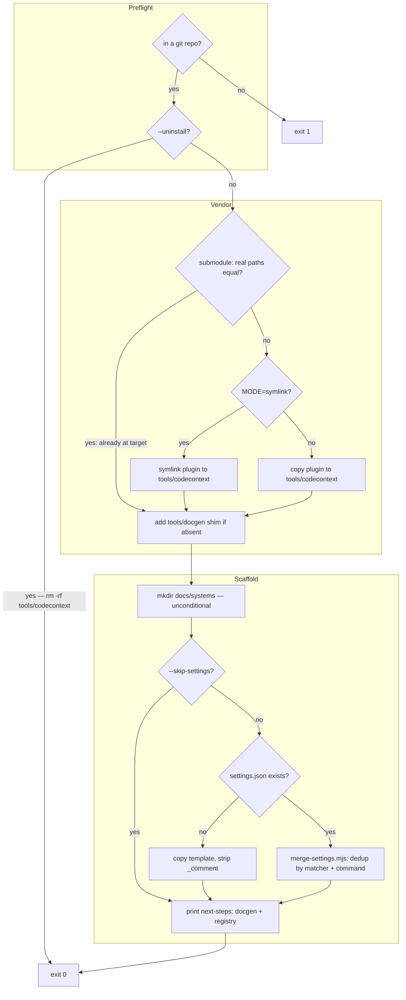

<!-- auto-generated by systems-registry — do not hand-edit. Run `tools/systems-registry/cli.mjs run` (full sweep) or `tools/systems-registry/cli.mjs refresh --changed <files>` (incremental) to refresh. -->

# installer

## What it does

`scripts/install.sh` wires the plugin into the host repo from which it's run: resolves `HOST_ROOT` via `git rev-parse --show-toplevel`, vendors the plugin at `tools/codecontext/` (symlink, copy, or submodule-skip), shims `tools/docgen → codecontext/docgen`, scaffolds `docs/systems/` unconditionally, then optionally merges `hooks/settings.json` into the host's `.claude/settings.json` via `scripts/merge-settings.mjs`. `INSTALL.md` documents three equivalent entry paths (native `/plugin install`, clone-and-run, `git submodule add`).

## The loop

## Anchors

- `scripts/install.sh` — the orchestrator: preflight, vendor (submodule-skip / symlink / copy), shim, unconditional scaffold, conditional settings dispatch.
- `scripts/merge-settings.mjs` — idempotent settings merge; groups plugin hook entries by `matcher`, dedups commands by exact `command` string.
- `hooks/settings.json` — the hook template that gets merged in (PreToolUse inject hooks, PostToolUse refresh, PreCompact/SessionStart dedup reset).
- `plugin.json` — capability + host-repo contract manifest declaring `directories: ["docs/systems"]` and `settings_merge: hooks/settings.json`.
- `INSTALL.md` — operator-facing doc covering the plugin/clone/submodule install paths, bootstrap commands, and pluggable-judge env overrides.

## Closing arrow

> _One-shot — see `kind: installer` in front-matter. No closing arrow._

## Decision logic

The vendor step branches in two sequential checks in `install.sh`: first, if the plugin's resolved path (`pwd -P` of `PLUGIN_ROOT`) equals the target's resolved path, it's a submodule scenario — re-linking would create a self-referential symlink, so file-install is skipped entirely. Otherwise `MODE` (default `symlink`, `--copy` flips it) selects `ln -s` vs `cp -R`, each first clearing any existing target with `rm -rf`. The scaffold and settings steps are independent of the vendor branch: `mkdir -p docs/systems` runs unconditionally before the `if (( ! SKIP_SETTINGS ))` block, so `--skip-settings` suppresses only the settings merge — directory scaffolding always occurs. Within the settings step, file existence determines whether a fresh template copy is written (with `_comment` stripped via `node -e`) or `merge-settings.mjs` is invoked to dedup into an existing file.

## Log flow

This system emits no cross-subsystem markers; all output is human-facing `✓`/`✅` status lines to stdout/stderr. The hooks it *installs* (inject, auto-docs-refresh, reset-inject-dedup) are the cross-subsystem signal sources, documented in their own systems.

| Marker / Event | Emitter (file:fn) | Fields | Consumer | Lands in |
|---|---|---|---|---|
| _none — installer prints status only_ | `scripts/install.sh` | — | operator (terminal) | stdout |

## Data tables

| Table / File | Schema / Migration | Writer (file:fn) | Reader (file:fn) | Purpose |
|---|---|---|---|---|
| `tools/codecontext/` (symlink or copy) | n/a | `install.sh` (vendor step) | Claude Code hook runtime (resolves `node tools/codecontext/...`) | Vendored plugin tree the host's hooks invoke |
| `tools/docgen` (symlink → `codecontext/docgen`) | n/a | `install.sh` (shim step) | callers probing `tools/docgen/docgen` | Back-compat shim for legacy docgen path |
| `docs/systems/` | `plugin.json` `host_repo_contract.directories` | `install.sh` (`mkdir -p`) | `systems-registry/cli.mjs`, optional `docs/systems/_context.md` | System-manifest output dir the registry writes into |
| `.claude/settings.json` | `hooks/settings.json` template | `merge-settings.mjs:writeFileSync` / `install.sh` fresh-copy | Claude Code harness (loads hooks) | Wires plugin hooks into the host session |

## Invariants

- Merge is idempotent: `merge-settings.mjs` dedups by exact `command` string via the `seen` Set, so re-running `install.sh` never accumulates duplicate hook commands.
- Hooks are grouped by `matcher` via strict `===` — a plugin entry merges its commands into the host entry with the same `matcher`; entries without a `matcher` field (e.g. PreCompact, SessionStart in `hooks/settings.json`) carry `matcher: undefined`, which groups correctly under JavaScript's strict equality (`undefined === undefined`).
- Submodule self-link guard: file-install is skipped when `pwd -P "$PLUGIN_ROOT"` equals `pwd -P "$TARGET"` (`install.sh`), preventing a self-referential symlink.
- Directory scaffold (`mkdir -p docs/systems`) is unconditional and executes before the `if (( ! SKIP_SETTINGS ))` block — `--skip-settings` only gates the settings merge, never the docs dir.
- `set -euo pipefail` in both shell scripts — any unset variable or failed command aborts the install rather than half-wiring the repo.

## Failure modes

- Run outside a git repo: `git rev-parse --show-toplevel` returns empty → `install.sh` exits 1 with a "Not in a git repo" message.
- `--uninstall` removes `tools/codecontext/` but does NOT remove the `tools/docgen` shim, which now points at the absent `tools/codecontext/docgen` — a dangling symlink the user must remove manually. `.claude/settings.json` hook entries are also left in place; both become no-ops but must be hand-edited for a clean slate.
- Node missing or old (<20): the fresh-copy `node -e` and `merge-settings.mjs` invocations fail; `plugin.json` declares `engines.node >=20` but `install.sh` does not enforce this at runtime.
- `--copy` mode: `rm -rf "$TARGET"` then `cp -R` on re-run silently clobbers any manually-edited copy under `tools/codecontext/`.
- `safe-pr-create.sh` hard-kills `gh pr create` at `--timeout` (default 180s) with exit 124; a PR that was mid-creation at the deadline may be left in an indeterminate state.

## Where to start reading

1. `INSTALL.md` — the operator's-eye view: which of the three install paths to pick and what each one wires up.
2. `scripts/install.sh` — the entry point; reading top-to-bottom gives the full install sequence and every branch.
3. `hooks/settings.json` — what actually gets wired into the host, so you know what the merge is installing.
4. `scripts/merge-settings.mjs` — the only non-trivial logic (idempotent matcher-grouped dedup).
5. `plugin.json` — the `host_repo_contract` that defines what a correctly-installed host looks like.