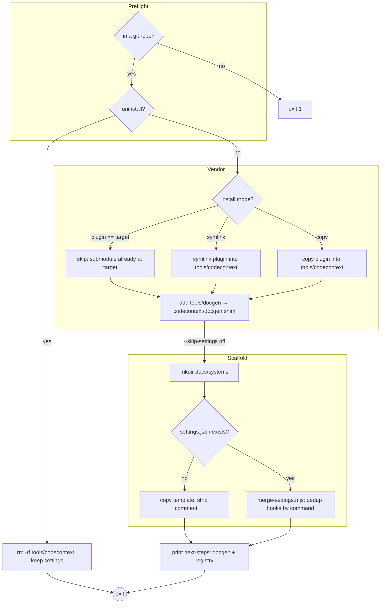

<!-- auto-generated by systems-registry — do not hand-edit. Run `tools/systems-registry/cli.mjs run` (full sweep) or `tools/systems-registry/cli.mjs refresh --changed <files>` (incremental) to refresh. -->

# installer

## What it does

`scripts/install.sh` wires the plugin into the host repo from which it's run: it resolves `HOST_ROOT` via `git rev-parse --show-toplevel`, symlinks (or `--copy`-copies) the plugin to `tools/codecontext/`, scaffolds `docs/systems/`, and merges `hooks/settings.json` into the host's `.claude/settings.json` via `scripts/merge-settings.mjs`. A `--uninstall` flag removes the vendored tree but intentionally leaves settings entries (dead hooks are no-ops).

## The loop

## Anchors

- `scripts/install.sh` — the orchestrator: preflight, vendor (symlink/copy/submodule-skip), shim, scaffold, settings dispatch.
- `scripts/merge-settings.mjs` — idempotent settings merge; groups plugin hook entries by `matcher`, dedups commands by exact `command` string.
- `hooks/settings.json` — the hook template that gets merged in (PreToolUse inject hooks, PostToolUse refresh, PreCompact/SessionStart dedup reset).
- `plugin.json` — capability + host-repo contract manifest declaring `directories: ["docs/systems"]` and `settings_merge: hooks/settings.json`.

## Closing arrow

> _One-shot — see `kind: installer` in front-matter. No closing arrow._

## Decision logic

The vendor step branches three ways in `install.sh`: if the plugin's real path (`pwd -P` of `PLUGIN_ROOT`) equals the target's real path, it's a `git submodule add` scenario — re-linking would create a self-referential symlink, so file-install is skipped entirely. Otherwise `MODE` (default `symlink`, `--copy` flips it) chooses `ln -s` vs `cp -R`, each first clearing any existing target with `rm -rf`. The settings step branches on file existence: a missing `.claude/settings.json` gets a fresh template copy with `_comment` stripped, while an existing one is passed to `merge-settings.mjs`, which preserves prior hooks and appends only commands whose exact `command` string isn't already present (the `seen` Set) — making re-runs idempotent.

## Log flow

This system emits no cross-subsystem markers; all output is human-facing `✓`/`✅`/`⚠️` status lines to stdout/stderr. The hooks it *installs* (inject, auto-docs-refresh, reset-inject-dedup) are the cross-subsystem signal sources, documented in their own systems.

| Marker / Event | Emitter (file:fn) | Fields | Consumer | Lands in |
|---|---|---|---|---|
| _none — installer prints status only_ | `scripts/install.sh` | — | operator (terminal) | stdout |

## Data tables

| Table / File | Schema / Migration | Writer (file:fn) | Reader (file:fn) | Purpose |
|---|---|---|---|---|
| `tools/codecontext/` (symlink or copy) | n/a | `install.sh` (vendor step) | Claude Code hook runtime (resolves `node tools/codecontext/...`) | Vendored plugin tree the host's hooks invoke |
| `tools/docgen` (symlink → `codecontext/docgen`) | n/a | `install.sh` (shim step) | callers probing `tools/docgen/docgen` | Back-compat shim for legacy docgen path |
| `docs/systems/` | `plugin.json` `host_repo_contract.directories` | `install.sh` (`mkdir -p`) | `systems-registry/cli.mjs`, optional `docs/systems/_context.md` | System-manifest output dir the registry writes into |
| `.claude/settings.json` | `hooks/settings.json` template | `merge-settings.mjs:writeFileSync` / `install.sh` fresh-copy | Claude Code harness (loads hooks) | Wires plugin hooks into the host session |

## Invariants

- Merge is idempotent: `merge-settings.mjs` dedups by exact `command` string (the `seen` Set), so re-running `install.sh` never accumulates duplicate hook commands.
- Hooks are grouped by `matcher` — a plugin entry merges its commands into the host entry with the same `matcher`, else the whole entry is appended (`merge-settings.mjs` `hostEntry` lookup).
- Submodule self-link guard: file-install is skipped when `pwd -P "$PLUGIN_ROOT" == pwd -P "$TARGET"` (`install.sh`), preventing a self-referential symlink.
- Fresh-copy path strips the `_comment` field from `settings.json`; the merge path leaves the host file's other keys untouched (only `host.hooks` is mutated).
- `set -euo pipefail` in both shell scripts — any unset var or failed command aborts the install rather than half-wiring the repo.

## Failure modes

- Run outside a git repo: `git rev-parse --show-toplevel` is empty → `install.sh` exits 1 with a "Not in a git repo" message.
- `--uninstall` removes `tools/codecontext/` but deliberately does NOT revert `.claude/settings.json`; the now-dangling hook commands become no-ops, leaving stale entries the user must hand-edit.
- Node missing/old (<20): the fresh-copy `node -e` and `merge-settings.mjs` invocations fail; `plugin.json` declares `engines.node >=20` but `install.sh` does not enforce it.
- `--copy` mode `rm -rf "$TARGET"` then `cp -R` — re-running over a live symlink target is safe, but a manually-edited copy under `tools/codecontext/` is silently clobbered.
- `safe-pr-create.sh` hard-kills `gh pr create` at `--timeout` (default 180s) with exit 124; a PR that was mid-creation at the deadline may be left in an indeterminate state.

## Where to start reading

1. `scripts/install.sh` — the entry point; reading top-to-bottom gives the full install sequence and every branch.
2. `hooks/settings.json` — what actually gets wired into the host, so you know what the merge is installing.
3. `scripts/merge-settings.mjs` — the only non-trivial logic (idempotent matcher-grouped dedup).
4. `plugin.json` — the `host_repo_contract` that defines what a correctly-installed host looks like.