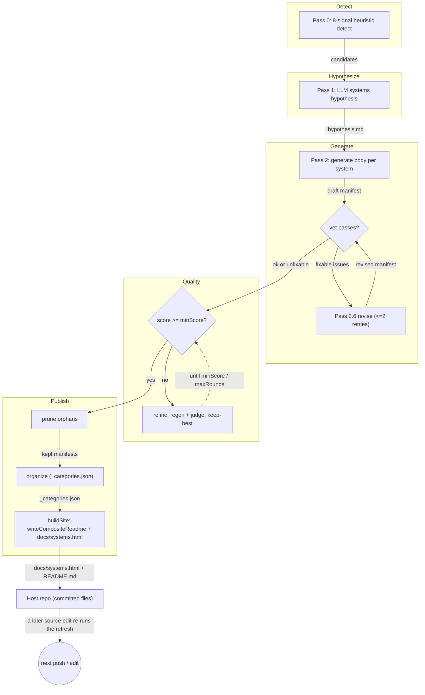
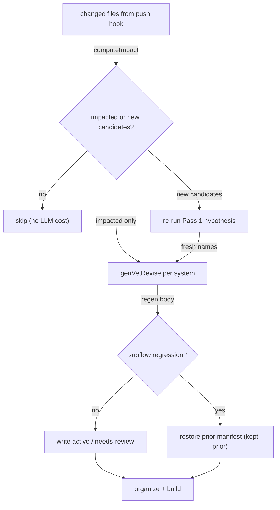
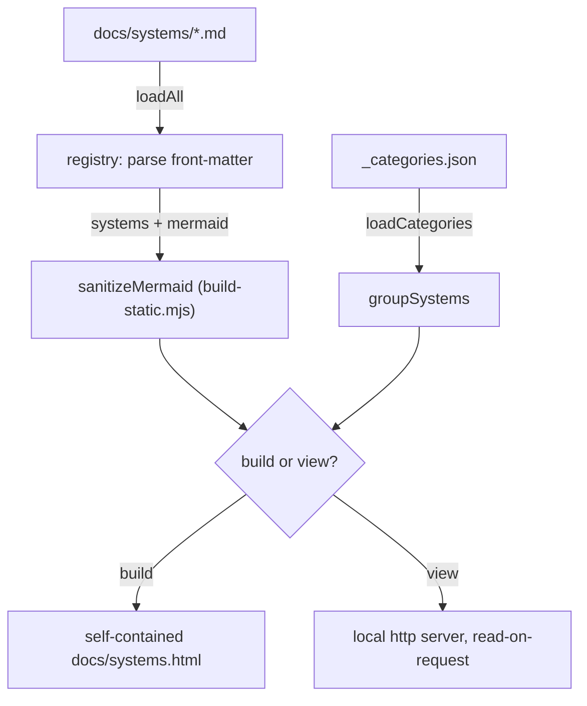

<!-- auto-generated by systems-registry — do not hand-edit. Run `tools/systems-registry/cli.mjs run` (full sweep) or `tools/systems-registry/cli.mjs refresh --changed <files>` (incremental) to refresh. -->

# systems-registry

## What it does

Turns a repo into a navigable map of its "complex systems": `detect()` in
`detect.mjs` scores every directory against 8 signatures and keeps those
≥ `MIN_SCORE`; `runPipeline()` in `run-pipeline.mjs` then fans the survivors
through a chain of `claude -p` passes — `runPass1` (hypothesis), `generateBody`
(per-system body), `vetSystem` (cheap + LLM checks), `reviseSystem`,
`validateSystem` (LLM-as-judge), and `refineSystem` (regen-to-target) — before
`runOrganize` and `buildSite` (which calls `writeCompositeReadme` as a side
effect) publish the manifests plus a single-file HTML viewer.

## The loop

## Subflow: incremental-refresh

The cheap, scoped re-entry used by the push hook: `refreshIncremental` in
`refresh.mjs` regenerates only the systems whose anchors changed, plus any
brand-new detector candidate, and otherwise skips entirely (~$0).

## Subflow: render

The read side: `buildSite` in `build-static.mjs` inlines every manifest into
one self-contained `docs/systems.html`, and `startServer` in `view.mjs` serves
the same content live (read-on-request) for local browsing.

## Anchors

- `systems-registry/run-pipeline.mjs` — orchestrates Pass 1→build in sequence; `detect()` is called internally by `pass1.mjs:gatherInputs`, not directly here; owns concurrency, token-budget metering, and orphan pruning
- `systems-registry/detect.mjs` — Pass 0; the 8-signal scorer + federation decomposition that produces candidates (invoked via `pass1.mjs:gatherInputs`)
- `systems-registry/pass2.mjs` — per-system body generator; anchor-file selection (`selectAnchorFiles`, `scoreFilename`), the prompt the LLM sees, and post-generation mermaid repair via `validateAndRepairBody` from `validate-mermaid.mjs`
- `systems-registry/validate.mjs` — Pass 2.7 LLM-as-judge; the weighted 5-dimension rubric + quality-score caching
- `systems-registry/refresh.mjs` — incremental scoped re-run (`computeImpact`, `genVetRevise`) used by the push hook

## Closing arrow

`pass2.mjs:generateBody` and `pass26-revise.mjs:reviseSystem` write
`docs/systems/<name>.md` during the generation phase. `runOrganize` writes
`_categories.json`. `buildSite` then writes `docs/systems.html` and calls
`writeCompositeReadme` as a side effect to produce `docs/systems/README.md`.
The sibling `auto-docs-refresh` hook commits these onto the branch, and
the next edit to any globbed source file re-enters via `refreshIncremental` →
`detect()`. The committed manifests are also read by the `context-injection`
system at hook time (`registry.mjs:loadAll` / `renderInjection`), feeding the
mermaid loop into the next Claude turn.

## Decision logic

The pipeline is a chain of gates, not pure plumbing. Vet outcomes only trigger
a revise when `hasFixableIssue` finds a kind in `FIXABLE_KINDS`
(run-pipeline.mjs) — runtime-artifact globs and runtime paths are unfixable and
ship as `needs-review` rather than burning retries. `refineSystem` (refine.mjs)
keeps the **best-scoring** round, not the last: a regen introducing more
`STRUCTURAL_BREAK_KINDS` than the prior best is rejected unjudged and the prior
body restored, guaranteeing a refine never ships a regression. `validateSystem`
scores five weighted dimensions (`WEIGHTS`: correctness 0.4, completeness 0.25,
sizing 0.15, diagram 0.1, clarity 0.1) and gates at `minScore` (default 7).
Cost is bounded two ways: `computeValidateScope` limits the judge to systems
whose globs match a changed file plus their transitive `consumes:` downstream,
and `skipUnchanged` skips the judge when `quality_input_hash` matches and the
stored score already clears `minScore`. The token `meter` aborts remaining work
at `maxTokensEst` (10M) and still runs organize + build with what completed.

## Log flow

This is a build pipeline, so cross-boundary communication is file-based (see
Data tables) rather than runtime log markers. The one field that crosses into
another system:

| Marker / Event | Emitter (file:fn) | Fields | Consumer | Lands in |
|---|---|---|---|---|
| `status: active\|needs-review\|draft` | `pass2.mjs:generateBody` / `pass26-revise.mjs:reviseSystem` (front-matter writes) | status | `registry.mjs:loadAll` (context-injection hook skips `draft`) | `docs/systems/<name>.md` |

## Data tables

| Table / File | Schema / Migration | Writer (file:fn) | Reader (file:fn) | Purpose |
|---|---|---|---|---|
| `docs/systems/_hypothesis.md` | YAML front-matter + `systems:` block | `pass1.mjs:runPass1` | `run-pipeline.mjs:parseHypothesisSystems`, `composite.mjs:parseHypothesis` | LLM systems map; single source of truth per run |
| `docs/systems/<name>.md` | manifest front-matter + body | `pass2.mjs:generateBody`, `validate.mjs:writeQualityScore` | `registry.mjs:loadAll`, `view.mjs:renderPage` | per-system manifest + cached `quality_score` / `quality_input_hash` |
| `docs/systems/_categories.json` | `{categories:[{name,systems}]}` | `organize.mjs:runOrganize` | `build-static.mjs` / `view.mjs:loadCategories` | sidebar semantic grouping (re-anchored each run) |
| `docs/systems/_context.md` | hand-written prose (≤16 KB) | maintainer (committed) | `pass1.mjs:repoContext` (called inside `gatherInputs`) | per-repo domain context tilting the hypothesis |
| `docs/systems/README.md` | composite mermaid + table | `composite.mjs:writeCompositeReadme` (called as side effect inside `buildSite`) | `build-static.mjs:loadComposite` | cross-system overview diagram |
| `docs/systems.html` | self-contained HTML | `build-static.mjs:buildSite` | browser (`file://`) | rendered viewer |

## Invariants

- Detector keeps only candidates scoring ≥ `MIN_SCORE = 4` across 8 signals; federation decomposition drills at most `FEDERATION_MAX_DEPTH = 6` levels (detect.mjs).
- Pass 2 samples `clamp(globs.length * FILES_PER_GLOB, 15, 35)` anchor files, each truncated to `ANCHOR_BYTE_CAP = 10240` bytes (pass2.mjs).
- Revise tries at most `MAX_RETRIES = 2` (3 total attempts); still-flagged manifests ship with `status: needs-review`, never blocking the run (pass26-revise.mjs).
- Judge dimension `WEIGHTS` sum to 1.0; default `minScore = 7` (validate.mjs / run-pipeline.mjs).
- Full-rewrite semantics: `pruneOrphans` deletes any `docs/systems/*.md` not produced this run, preserving only `README.md` and `_hypothesis.md` (run-pipeline.mjs).
- `refineSystem` ships the best-scoring round, never a structurally-broken later one (refine.mjs).

## Failure modes

- A transient `claude -p` failure is retried by `withRetry` (2 retries, 8s/16s backoff, llm-retry.mjs); Pass 1 is a single call and therefore the run's one single point of failure.
- Crossing `maxTokensEst` flips `meter.abort`; the sweep stops generating but still runs organize + build with completed systems (run-pipeline.mjs).
- A refine regen that drops sections / empties the diagram is rejected by `structuralBreaks`, keeping the prior best (refine.mjs).
- An incremental refresh that drops mermaid subflows the prior manifest had is reverted to the prior body (`kept-prior`) via `checkSubflowRegression` (pass25-vet.mjs / refresh.mjs).
- Mermaid syntax bugs are repaired best-effort by `validateAndRepairBody` in `validate-mermaid.mjs` during generation (called from pass2.mjs); blocks still broken after `maxRounds` pass through unchanged.
- `docs/systems/_context.md` is pruned by `pruneOrphans` on every full `run` — it is not in the fixed keep-set (`README.md` + `_hypothesis.md`); restore with `git checkout` after a full sweep (the file itself warns of this).

## Where to start reading

1. `systems-registry/run-pipeline.mjs` — the orchestrator; the whole pass sequence and its cost controls live here
2. `systems-registry/cli.mjs` — command entry points (`detect`, `scaffold`, `status`, `hypothesis`, `vet`, `run`, `refresh`, `validate`, `refine`, `build`, `view`)
3. `systems-registry/detect.mjs` — Pass 0; how a "system" is defined heuristically
4. `systems-registry/pass2.mjs` — how a manifest body is generated and which source the LLM sees
5. `systems-registry/validate.mjs` — the judge rubric that defines "good", and the refine loop it feeds