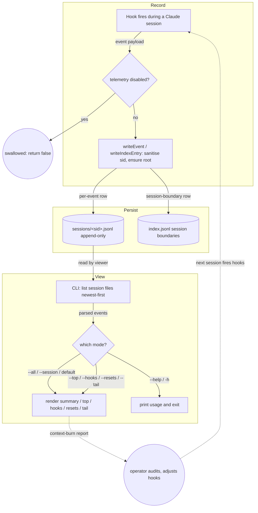

<!-- auto-generated by systems-registry — do not hand-edit. Run `tools/systems-registry/cli.mjs run` (full sweep) or `tools/systems-registry/cli.mjs refresh --changed <files>` (incremental) to refresh. -->

# telemetry

## What it does

The context-injection hooks call `writeEvent()` (and the reset path calls `writeIndexEntry()`) in `telemetry/writer.mjs` to append one JSON line per fire under `~/.claude-telemetry/sessions/<sid>.jsonl`; `telemetry/cli.mjs` then reads those files back and renders per-session, per-hook, per-file, and reset rollups so the operator can audit context burn across every repo and session.

## The loop

## Anchors

- `telemetry/writer.mjs` — `writeEvent()` / `writeIndexEntry()`: the best-effort append path every hook calls; owns root resolution, sid sanitisation, row shape.
- `telemetry/cli.mjs` — `main()` + `parseArgs()`: the entry point that dispatches every view mode, including `--help`/`-h` usage output.
- `telemetry/cli.mjs` — `summariseEvents()` / `renderSessionSummary()`: the core rollup (bytes, by-hook, by-event, reset counts) that turns raw rows into the operator view.

## Closing arrow

The loop closes through disk: hooks append rows to `~/.claude-telemetry/sessions/<sid>.jsonl`, and the CLI viewer reads the same files on demand to produce a context-burn report. The operator reads that report and tunes which hooks inject what, changing the events emitted on the next session — a human-in-the-loop dashboard cycle rather than an automated callback.

## Decision logic

The writer is a gate, not a policy: `isDisabled()` short-circuits when `CLAUDE_TELEMETRY_DISABLED === '1'`, and every other failure is swallowed by the surrounding `try/catch` so telemetry can never block a hook's real context flow. The CLI's mode routing is handled in `parseArgs()` — `--all`, `--session <sid>`, `--top`, `--hooks`, `--resets`, `--tail [N]`, `--help`/`-h`, defaulting to the newest session file by mtime. Ranking modes differ: `renderHooks` (`cli.mjs:138`) sorts descending by `bytes_emitted` and breaks ties on event count (`|| b[1].count - a[1].count`), while `renderTop` (`cli.mjs:111`) sorts by bytes only with no secondary key. `renderResets` displays the most recent 50 reset events in reverse chronological order (`cli.mjs:147` `resets.slice(-50).reverse()`).

## Log flow

| Marker / Event | Emitter (file:fn) | Fields | Consumer | Lands in |
|---|---|---|---|---|
| `event:'injected'` | `writer.mjs:writeEvent` | hook, sid, cwd, target_file, bytes_emitted, files_injected | `cli.mjs:summariseEvents` | `sessions/<sid>.jsonl` |
| `event:'deduped'` | `writer.mjs:writeEvent` | hook, sid, cwd, target_file | `cli.mjs:summariseEvents` (byEvent) | `sessions/<sid>.jsonl` |
| `event:'reset'` | `writer.mjs:writeEvent` | hook, sid, reason, dedup_files_removed (from extra, optional) | `cli.mjs:renderResets` | `sessions/<sid>.jsonl` |
| `event:'refresh-spawned'` / `'refresh-skipped'` | `writer.mjs:writeEvent` | hook, sid, cwd | `cli.mjs:renderHooks` | `sessions/<sid>.jsonl` |
| `event:'noop'` | `writer.mjs:writeEvent` | hook, sid, cwd | `cli.mjs:summariseEvents` (byEvent) | `sessions/<sid>.jsonl` |
| `kind:'session-boundary'` | `writer.mjs:writeIndexEntry` | sid, kind, extra | (index heartbeat; not yet read by CLI) | `index.jsonl` |

## Data tables

| Table / File | Schema / Migration | Writer (file:fn) | Reader (file:fn) | Purpose |
|---|---|---|---|---|
| `sessions/<sid>.jsonl` | implicit row in `writer.mjs:writeEvent` | `writer.mjs:writeEvent` | `cli.mjs:readJsonl` (via `listSessionFiles`/`loadAllEvents`) | One event per hook fire; the per-session audit trail |
| `index.jsonl` | implicit row in `writer.mjs:writeIndexEntry` | `writer.mjs:writeIndexEntry` | (none in CLI yet — written at PreCompact/SessionStart) | Coarse session-boundary heartbeat |
| `~/.claude-telemetry/` (root) | `writer.mjs:telemetryRoot` (env `CLAUDE_TELEMETRY_ROOT`) | `writer.mjs:ensureRoot` | `cli.mjs:SESSIONS_DIR` existence check | Machine-wide, repo-independent storage location |

## Invariants

- Telemetry must never throw into a hook: every write is wrapped in `try/catch` returning `false` (`writer.mjs:writeEvent`/`writeIndexEntry`).
- Session ids are filename-safe: `sanitiseSid()` replaces non-`[A-Za-z0-9._-]` chars with underscore and caps at 64 chars (`writer.mjs:58`).
- Root is resolved per-call (`telemetryRoot()` / `sessionsDir()`), not at import, so subprocess-spawned hooks honour a freshly-set `CLAUDE_TELEMETRY_ROOT`.
- `bytes_emitted` is coerced to a number-or-null and `files_injected` to an array-or-null, keeping rows shape-stable for the CLI's `?? 0` accounting.
- A single `CLAUDE_TELEMETRY_DISABLED=1` toggle suppresses all logging (`isDisabled()`); default is on.
- Display caps: `renderTop` shows the top 15 files by default (`cli.mjs:102`); `renderTail` shows 20 events by default (`cli.mjs:119`); `renderResets` caps display at the 50 most recent reset events (`cli.mjs:147`).

## Failure modes

- Read-only `HOME` or permission errors make `ensureRoot()` throw — silently swallowed, so events are dropped with no signal to the operator.
- The frozen back-compat constants `TELEMETRY_ROOT`/`SESSIONS_DIR`/`INDEX_PATH` capture the import-time env; `cli.mjs` imports `SESSIONS_DIR`, so flipping `CLAUDE_TELEMETRY_ROOT` after the CLI starts won't redirect it.
- Malformed JSONL lines are skipped by `readJsonl`'s inner `try/catch`, so a partially-written row is dropped from every rollup without warning.
- `index.jsonl` is written but never read by the CLI — session-boundary heartbeats accumulate with no consumer.

## Where to start reading

1. `telemetry/writer.mjs` — defines the row shape, storage location, and the best-effort contract everything else depends on.
2. `telemetry/cli.mjs` `parseArgs`/`main` — the entry point that shows every way the data is consumed.
3. `telemetry/cli.mjs` `summariseEvents` — the rollup logic that defines what the operator actually sees.